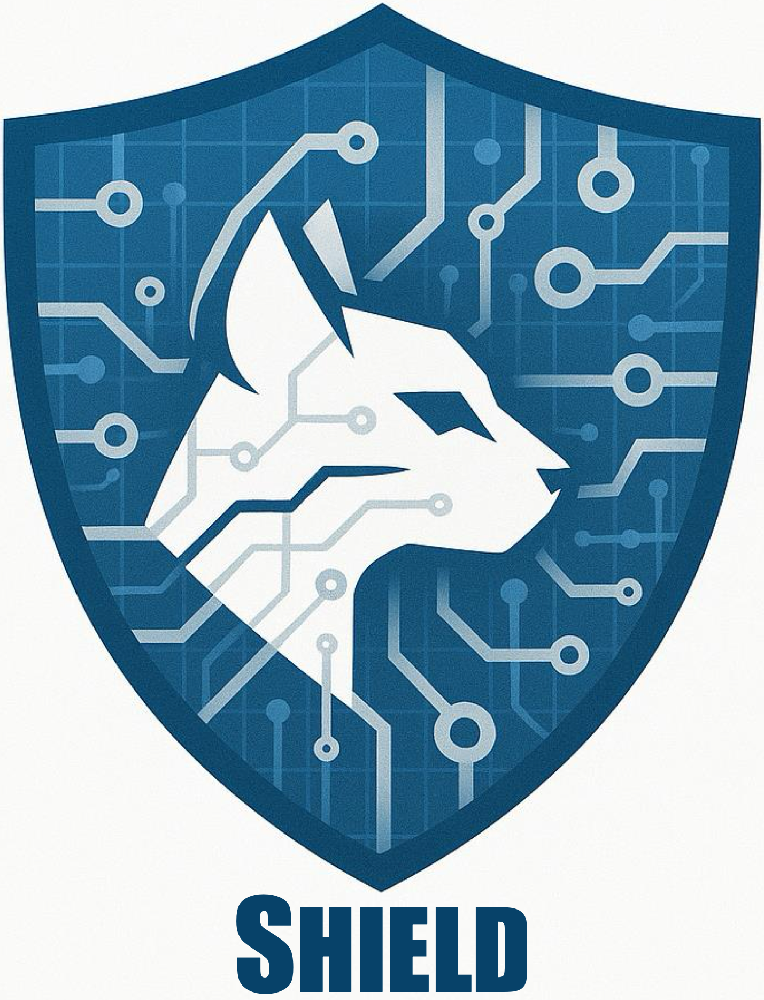
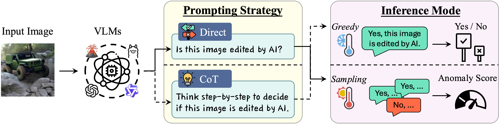

<div align="center">
    
</div>

# SHIELD: A Benchmark Study on Zero-Shot Detection of AI-Edited Images with Vision Language Models


Table of Contents
=================
- [Table of Contents](#table-of-contents)
  - [Overview](#overview)
  - [Code Architecutre](#code-architecture)
  - [Environments](#environments)
  - [Experiments](#experiments)
    - [Usage](#usage)
    - [Configurations](#configurations)
    - [Outputs](#outputs)
  - [Citation](#citation)
  - [Acknowledgement](#acknowledgement)

## Overview
- This is the PyTorch implementation for NeurIPS 2025 Workshop (*the 1st GenProCC*) paper "[SHIELD: A Benchmark Study on Zero-Shot Detection of AI-Edited Images with Vision Language Models]([assets/camera_ready.pdf](https://openreview.net/forum?id=hEZPVTDXCy))".
<!-- - [[arXiv](https://arxiv.org/abs/2403.17188)\] | \[[video](https://www.youtube.com/watch?v=AoP6tlFmSqQ&t=12s)\] | \[[slides](https://www.cs.purdue.edu/homes/cheng535/static/slides/LOTUS_slides.pdf)\] | \[[poster](https://www.cs.purdue.edu/homes/cheng535/static/slides/LOTUS_poster.pdf)\] -->



## Code Architecture
    .
    ├── assets            # Project assets (figures and paper)
    ├── data              # Evaluation data
    │   └── example.png   # Example test image
    ├── VLMs              # Model architectures
    │   ├── base.py       # Base VLM detector class
    │   └── ...           # Specific VLM detector implementations
    ├── prompts.py        # Prompts for different settings
    ├── run_ds.sh         # Script for running experiments (for DeepSeek models)
    ├── run.sh            # Script for running experiments
    ├── test.py           # Main testing program
    └── utils.py          # Utility functions

## Environments
```bash
# Create python environment
conda env create -f environment.yml
conda activate shield

# Create python environment (for DeepSeek models)
# DeepSeek models require special dependencies
conda create -f environment_ds.yml
conda activate shield_ds
```

## Experiments  
We provide SHIELD implementation for evaluating various Vision Language Models (VLMs) on detecting AI-edited images.
We support 24 different VLMs, including LLava, InternVL, Ovis, Qwen-VL, DeepSeek-VL, etc.
We provide the evaluation for an example image in `data/example.png`, and you can easily extend the evaluation to a dataset (e,g, we use [Semi-Truths-Eval](https://huggingface.co/datasets/semi-truths/Semi-Truths-Evalset) in our paper) by modifying the `--image_filepath` in `test.py`.

### Usage
To evaluate whether an image is edited by AI, run:
```bash
CUDA_VISIBLE_DEVICES="0" python test.py --model_id llava-1.5-7b --image_filepath data/example.png --result_dir results --phase direct --mode greedy
```
This command evaluates the image `data/example.png` using the LLava-1.5-7B model with direct prompting and greedy decoding, and saves the results in the `results` directory.

### Configurations
The specific arguments and hyperparameters used to launch SHIELD can be found in `test.py`, particularly in lines 152-207.

Here you go:

| Hyperparameter          | Default Value      | Description                                   |
| ----------------------- | ------------------ | --------------------------------------------- |
| `model_id`              | **(required)**     | ID of the VLM model to use.                   |
| `image_filepath`        | `data/example.png` | Path to the input image file.                 |
| `result_dir`            | `results`          | Directory to save the results.                |
| `phase`                 | `direct`           | Evaluation phase; choices: `direct`, `cot`.   |
| `mode`                  | `greedy`           | Decoding mode; choices: `greedy`, `sampling`. |
| `max_new_tokens_direct` | `256`              | Max new tokens for direct prompting.          |
| `max_new_tokens_cot`    | `1024`             | Max new tokens for CoT prompting.             |
| `sampling_test_times`   | `5`                | Number of runs when using sampling.           |
| `sampling_temperature`  | `0.7`              | Temperature for sampling inference.           |
| `seed`                  | `1024`             | Random seed for reproducibility.              |

### Outputs
Outputs will be saved in the specified `result_dir`.
For example, if we evaluate the image `data/example.png` using the LLava-1.5-7B model with direct prompting and greedy decoding, the result file will be saved as:
```
results/llava-1.5-7b/direct/greedy/example.json
```
It contains the raw model response and requires either keyword matching or judge model to produce a final score (please refer to Section 3.3 of our paper for more details).


## Citation
Please cite our paper if you find it useful for your research.😀

```bibtex
@inproceedings{cheng2025shield,
  title={SHIELD: A Benchmark Study on Zero-Shot Detection of AI-Edited Images with Vision Language Models},
  author={Cheng, Siyuan and Guo, Hanxi and Wang, Zhenting and Zhang, Xiangyu and Lyu, Lingjuan},
  booktitle={The First Workshop on Generative and Protective AI for Content Creation},
  year={2025}
}
```

## Acknowledgement
- [SemiTruths](https://github.com/J-Kruk/SemiTruths/tree/main)
- [OpenVLM Leaderboard](https://huggingface.co/spaces/opencompass/open_vlm_leaderboard)
